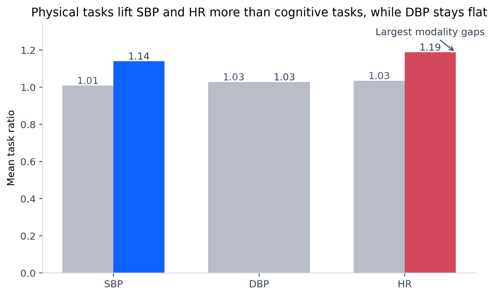
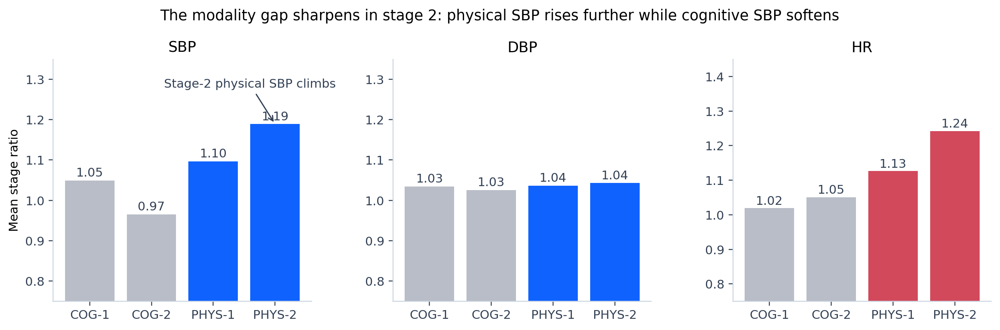
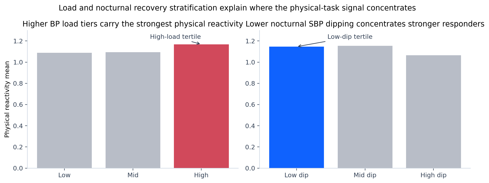
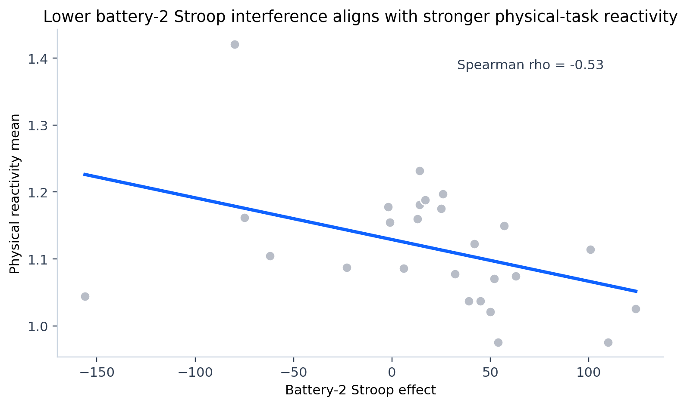
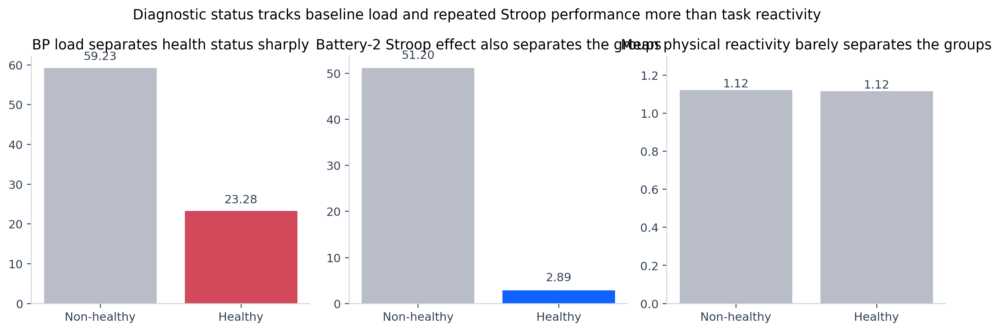

# Task reactivity in this ABPM cohort is primarily a physical-stage SBP and HR phenomenon, with the clearest participant-level signals coming from lower nocturnal dipping, smaller battery-2 Stroop interference, and a directional increase with BP load.

*Prepared for Scientists • 2026-04-17*

## Executive Summary

The primary question was which participant characteristics align with stronger hemodynamic reactivity during cognitive and physical stress tasks. The validated answer is narrower than a generic stress-response story: in this cohort, the dominant signal is a physical-task surplus in SBP and HR, concentrated in stage 2 rather than spread evenly across all channels.

The clearest participant-level signals around that physical-task pattern are lower nocturnal SBP dipping and smaller battery-2 Stroop interference, with BP load moving in the same direction but at lower certainty. The healthy versus non-healthy split is important for baseline load and repeated cognitive performance, but it does not create a comparably strong separation in mean task reactivity itself.

## Context

Physical-task ratios exceed cognitive-task ratios within participants, especially in SBP and HR. DBP remains close to flat across modalities, which matters because it means the aggregate modality effect is not a generic “everything rises” response.

## What's Happening

The modality gap sharpens in stage 2. Physical SBP rises further from stage 1 to stage 2, while cognitive SBP softens, so the late-stage physical segment carries the clearest contrast in the dataset.

Stratifying the cohort shows where the strongest physical responders cluster. Higher BP load tiers have the largest mean physical reactivity, while stronger nocturnal SBP dipping corresponds to weaker physical reactivity. The code does not show a subgroup reversal under diagnostic-status stratification, so the aggregate direction is stable.

## Root Cause And Recommendations

The secondary cognitive-performance question points to an unexpected but coherent interpretation: participants with smaller battery-2 Stroop interference also show stronger physical-task reactivity. In this sample, that looks more like preserved autonomic reserve than generalized dysregulation, but the sample is small enough that the result stays medium confidence.

Health status sharpens the baseline phenotype instead of the acute reactivity phenotype. Non-healthy participants carry much higher BP load and worse battery-2 Stroop interference, yet the mean physical-task reactivity difference remains small.

### Recommendations

| # | Recommendation | Owner | Success metric | Confidence | Follow-up |
|---|---|---|---|---|---|
| 1 | Prioritize physical-task SBP and HR endpoints, especially stage 2, as the primary physiological readouts in the next mechanistic study. | Study investigators | Replicate the physical-vs-cognitive SBP and HR gap in an expanded cohort with pre-registered thresholds. | High | 2026-06-15 |
| 2 | Stratify future analyses by nocturnal SBP dipping and ABPM load before aggregating task responses. | Biostatistics team | Prospective models retain the same direction and improve explained variance over unstratified models. | Medium | 2026-06-15 |
| 3 | Test whether battery-2 Stroop interference is a surrogate of preserved autonomic reserve rather than a marker of dysregulation. | Cognitive physiology workstream | A replication dataset confirms the inverse Stroop-effect to physical-reactivity relationship after multivariable adjustment. | Medium | 2026-07-01 |

## Appendix

### Methodology

- Phase 1 framing: `framing.md`
- Exploration and reproducible tables: `notebooks/02_explore.py`
- Validation and confidence grading: `validation.md`
- Chart generation scripts: `chart_scripts/`

### Validation Summary

- Every headline claim was independently re-derived in `notebooks/03_validate.py`.
- Simpson's Paradox checks were run on all aggregate claims by diagnostic-status subgroup.
- Confidence grades vary by result: the modality headline is High, while the load, dipping, and Stroop associations remain Medium-confidence directional signals.

### Caveats

- The cohort is small (`n=28`), so the findings are best used to prioritize follow-up studies rather than to make definitive population claims.
- Cognitive stage-2 ratios are the sparsest measures in the dataset and should be read directionally.
- The analysis is observational and association-based; it does not identify causal mechanisms.
